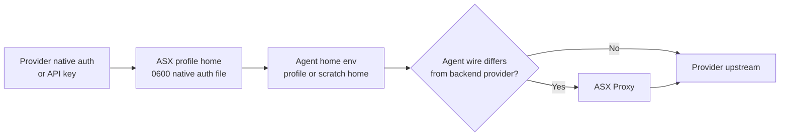
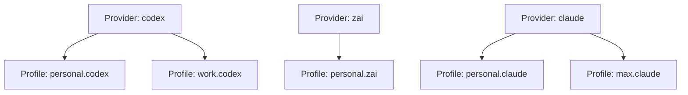
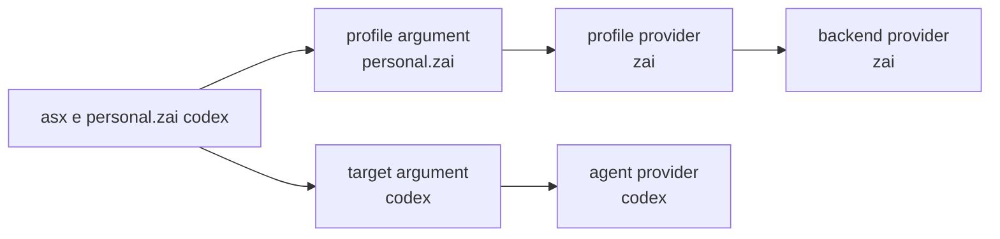
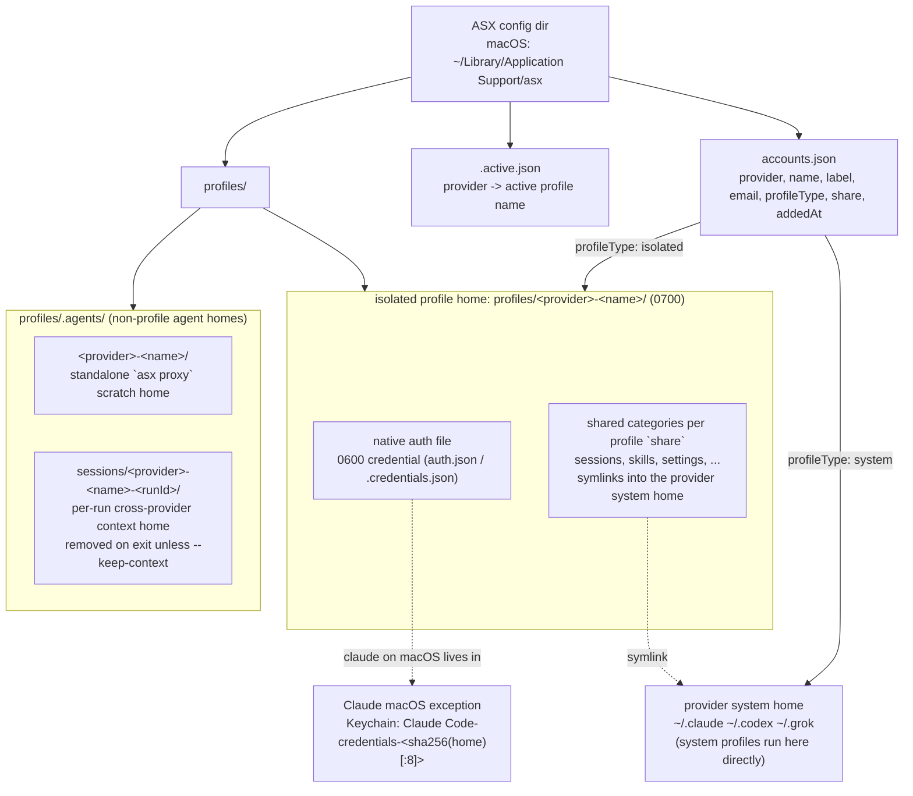
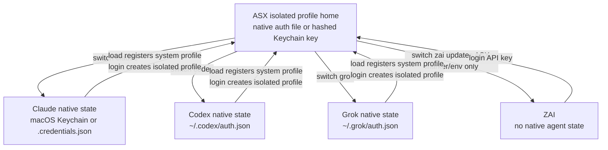
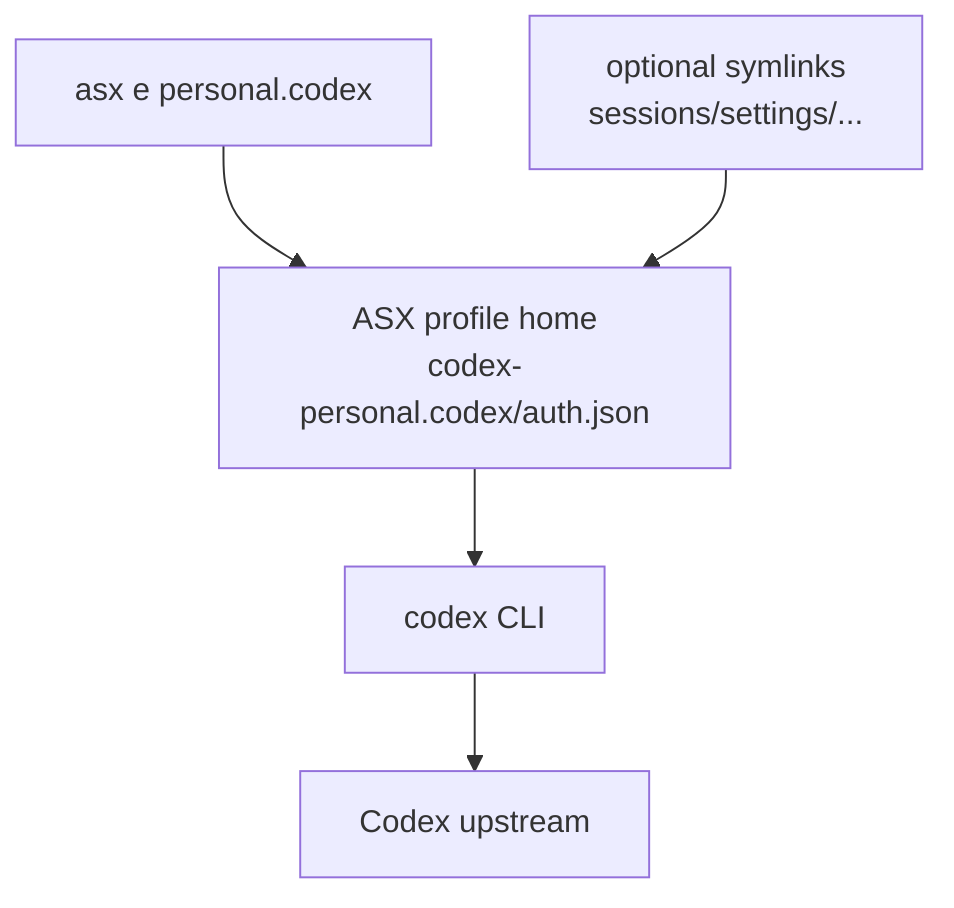
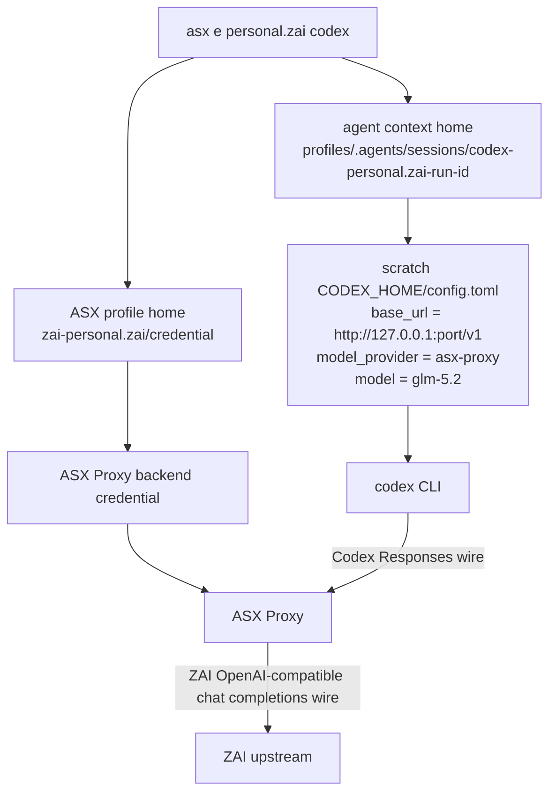
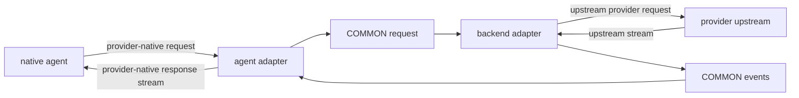
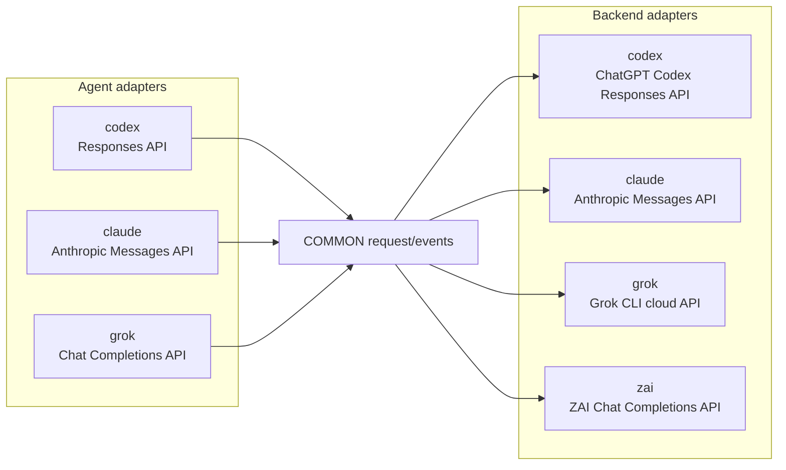

# Architecture

ASX is a small CLI that separates credential ownership from agent execution.

The core path is:



## Core Terms

```text
Provider
  A credential/backend family such as claude, codex, grok, or zai.

Profile
  One named ASX account under a provider.
  Stored as: provider + name + profile home credential + metadata.

Agent
  The native CLI process ASX launches, such as codex, claude, or grok.

Backend
  The upstream provider that receives the final model request.
```

Provider and profile are related like this:



The profile chooses the credential. The optional target argument chooses the launched agent.



## Main Layers

### CLI

`src/cli.ts` owns command parsing and user-facing flows.

Main commands:

- `load`: snapshot the current native provider credential into ASX.
- `login`: run a provider login flow and store the result.
- `sharing`: show or change which default-home state a profile symlinks.
- `switch`: write a stored credential back to the provider's native location.
- `exec` / `e`: run an agent with a profile-scoped home.
- `proxy`: expose a standalone ASX Proxy endpoint.

The CLI does orchestration only. Provider-specific credential rules live in provider adapters.

### Storage

ASX keeps secrets and metadata separate.

- `src/storage/profile-home.ts` maps isolated `(provider, name)` profiles to a stable profile home and native auth filename.
- `src/storage/secure-store.ts` stores credentials as `0600` files, except Claude on macOS where the profile-specific Keychain service is the source of truth.
- `src/storage/account-store.ts` stores account metadata, labels, email, profile type, and active markers.
- `src/storage/shared-state.ts` symlinks selected history/settings state from the provider's system home into an isolated profile or scratch home.

The full on-disk profile structure:



Credential files are named like the native CLI expects:

```text
claude -> .credentials.json
codex  -> auth.json
grok   -> auth.json
other  -> credential
```

Profile homes live under the platform ASX config directory:

```text
macOS:   ~/Library/Application Support/asx/profiles/
Linux:   ~/.config/asx/profiles/
Windows: %APPDATA%/asx/profiles/
```

There is no `vault.json`, migration layer, or `/tmp` credential copy in the current storage model. Claude on macOS is the exception to file storage: ASX uses Claude Code's profile-specific Keychain service.

### System Profiles vs Isolated Profiles

ASX has two profile types:

- **system profile**: registered by `asx load`; uses the provider's normal user-level home path.
- **isolated profile**: created by `asx login`; uses an ASX-owned profile home.

Provider-native state is what the original tool reads when it runs normally without ASX.



`exec` avoids mutating provider-native state by setting the launched process's home env var to a profile or scratch home.

`exec --desktop` uses the provider desktop app when available. Same-provider desktop launches return immediately. Cross-provider desktop launches stay attached because the in-process ASX Proxy and scratch context home must live for the app session. Codex app-bundle launches with `CODEX_HOME` pass a profile-scoped `--user-data-dir`; Claude Desktop launches with `CLAUDE_CONFIG_DIR` set `CLAUDE_USER_DATA_DIR` to the same profile-scoped `desktop-user-data` directory.

Claude Desktop login state is treated as desktop-app browser state, not as the Claude Code credential managed by ASX. ASX does not inject or copy Claude Code OAuth credentials into Claude Desktop; the supported workaround is a per-profile `CLAUDE_USER_DATA_DIR` that can keep its own signed-in Desktop session.

### Provider Adapters

Provider adapters implement `ProviderAdapter` from `src/providers/base.ts`.

Common responsibilities:

- `loadCurrent(name)`: read the live provider credential and store it in ASX.
- `switchTo(name)`: make a stored profile active for normal native provider use.
- `getCurrentCredential()`: read the live provider credential for `list` matching.
- `getUsage(name)`: return displayable quota or usage text.
- `refresh(name)`: rotate expiring stored credentials when the provider supports it.
- `login(name)`: handle providers with no native CLI login, such as ZAI API keys.
- `getLoginCommand()`: return a native login command for providers with native auth.

Current provider mapping:

- `claude`: `src/providers/claude-code.ts`
- `codex`: `src/providers/codex.ts`
- `grok`: `src/providers/key-adapter.ts`
- `zai`: `src/providers/key-adapter.ts`
- `cursor`: `src/providers/cursor.ts`

## Credential Flows

### Claude

Claude native login for isolated profiles sets `CLAUDE_CONFIG_DIR` to the profile home before running `claude auth login`. On macOS, Claude stores OAuth credentials in the Keychain service `Claude Code-credentials-<sha256(CLAUDE_CONFIG_DIR)[:8]>`; on Linux/Windows, it uses `.credentials.json`. If the target profile is current in system, ASX does not override `CLAUDE_CONFIG_DIR`.

Normal Claude profiles store access/refresh credentials in the provider-native store: macOS Keychain for Claude Code, `.credentials.json` on Linux/Windows. Claude long-lived profiles store a wrapper containing `CLAUDE_CODE_OAUTH_TOKEN`; `exec` injects that value into the spawned process.

Profile homes are stable, so concurrent Claude sessions for the same ASX profile share Claude's own credential file.

### Codex

Codex reads and writes `auth.json` under `CODEX_HOME`.

ASX snapshots the current `auth.json` into the profile home. During same-provider `exec`, `CODEX_HOME` points directly at that profile home, so refreshed tokens persist in place.

### Grok

Grok native login runs `grok login`.

ASX snapshots the full `auth.json` under `GROK_HOME` or `~/.grok` into the profile home, preserving the issuer wrapper. `switch` writes the stored Grok auth back to `auth.json`.

For usage and proxy calls, ASX extracts the bearer token from either the full Grok auth wrapper or a bare token.

### ZAI

ZAI has no native agent login in ASX. `asx login zai` asks for an API key, verifies it with:

```text
GET https://api.z.ai/api/coding/paas/v4/models
```

Then it stores the key in the profile home.

`asx load zai` can also read `ZAI_API_KEY` or `ZAI_KEY` from the environment.

`asx list zai -u` reads 5-hour quota from:

```text
GET https://api.z.ai/api/monitor/usage/quota/limit
```

ZAI `switch` cannot write to a native agent config because ASX does not manage a ZAI native agent. It updates ASX's active marker and exposes `ZAI_API_KEY` inside the current process.

## Profile-Scoped Execution

`asx exec <profile> [target?]` chooses two providers:

- profile provider: where the stored credential comes from.
- agent provider: which native binary is launched.

If no target is passed, both are the profile provider.

If a target is passed, ASX launches the target agent and uses the profile provider as the backend through ASX Proxy.

Examples:

```text
asx e personal.codex
  profile=codex, agent=codex, backend=codex

asx e personal.zai codex
  profile=zai, agent=codex, backend=zai
```

Agent home selection is controlled through provider home env vars:

- Codex: `CODEX_HOME`
- Claude: `CLAUDE_CONFIG_DIR`
- Grok: `GROK_HOME`

### Same-Provider Execution

When profile provider and agent provider are the same, ASX runs system profiles on the provider's normal home path. Isolated profiles run with the profile home as the native home.



No ASX Proxy is needed because the launched agent already speaks the backend provider's native wire format.

### Profile Sharing / Isolation

Shared-state symlinks are category-controlled for isolated agent profiles. The profile's
`share` metadata (set at `asx login`, changed with `asx sharing`) selects categories:

- unset `share`: share the provider's safe default categories.
- `share: []`: share nothing.
- `share: ["sessions", ...]`: share only those categories.

Supported categories are provider-specific. Claude supports `sessions`, `skills`, `agents`, `hooks`, and `settings`; Codex supports `sessions`, `skills`, `settings`, `state`, `cache`, and `logs`; Grok supports `sessions`, `skills`, and `settings`. Codex `state`, `cache`, and `logs` are explicit opt-in categories, not part of the unset/default share set.

`src/storage/shared-state.ts` owns the category → home-entry mapping:

```text
sessions  claude: projects/ sessions/ shell-snapshots/ file-history/ plans/ tasks/ todos/ history.jsonl
          codex:  sessions/ archived_sessions/ history.jsonl session_index.jsonl
          grok:   sessions/ projects/ active_sessions.json
skills    all:    skills/
agents    claude: agents/
hooks     claude: hooks/
settings  claude: plugins/ settings.json CLAUDE.md
          codex:  rules/ plugins/ AGENTS.md config.toml
          grok:   completions/ config.toml
state     codex:  .codex-global-state.json .codex-global-state.json.bak
                  .app-server-state-reconciled-v1 .personality_migration sqlite/
                  state_*.sqlite* goals_*.sqlite* memories_*.sqlite*
cache     codex:  cache/ vendor_imports/ models_cache*.json
logs      codex:  log/ logs_*.sqlite*
```

Linking rules (`linkSharedState`):

- Auth files and tmp/process scratch are never in the map. Codex runtime state/cache/log
  entries are in the map but require an explicit `--share state,cache,logs` selection.
- Shared directories are created in the system home if missing, so new history written
  through the link lands in the shared home; missing shared *files* are simply skipped.
- An existing real file/dir in the profile home is never clobbered by a symlink; only
  stale symlinks are replaced.
- On cross-provider runs `config.toml` is excluded even when `settings` is shared — the
  proxy injection writes its own and must not overwrite the user's real config.
- Everything is best-effort: a missing or odd system home never blocks execution.

Cross-provider runs take the same selection per run via `-s`/`-i`/`--share`/`--isolate`
(default: the agent provider's safe default category set), applied to the throwaway context home.

### Cross-Provider Execution

When profile provider and agent provider differ, ASX starts a local proxy and launches the agent under a fresh per-run context home. The context can share the target agent's history/settings categories, but the real backend credential stays in the profile home and is only read by ASX Proxy. The context is removed on normal exit, error, SIGINT, or SIGTERM unless `--keep-context` or `ASX_KEEP_CONTEXT=1` is set.



Cross-provider exec consumes ASX options before forwarding agent args. `-s`/`--shared` shares the target provider's safe default categories; `-i`/`--isolated` shares none; `--share <categories>` and `--isolate <categories>` narrow the per-run context. Args after `--` are always forwarded to the agent.

In this mode:

- The profile provider supplies the credential.
- The target agent supplies the local UX and request wire format.
- The proxy converts between the agent wire and backend wire.
- The native agent never receives the real backend credential directly.

## ASX Proxy

ASX Proxy is a local in-process HTTP proxy used when the launched agent wire differs from the stored backend credential.

The proxy shape is:



Files:

- `src/proxy/server.ts`: local HTTP server and request routing.
- `src/proxy/types.ts`: COMMON request, response, and adapter contracts.
- `src/proxy/inject.ts`: writes scratch-home config/env so native agents point at ASX Proxy.
- `src/proxy/models.ts`: backend model choices shown to the launched agent.
- `src/proxy/adapters/*`: agent/backend wire adapters.

`GET /models` and `GET /v1/models` return the backend model choices. This lets Codex and Grok display backend-specific model choices during cross-provider runs.

### Agent Injection Details

Each agent needs a different mechanism to (a) point at the proxy and (b) show backend
models in its own picker:

- **Codex**: a scratch `CODEX_HOME/config.toml` forces `model_provider = "asx-proxy"`
  (`wire_api = "responses"`), plus a `models.json` catalog referenced by
  `model_catalog_json`. Codex 0.142.x requires the full `ModelInfo` shape
  (`slug`/`display_name`/`truncation_policy`/...) or its `/model` picker degrades.
- **Claude**: `ANTHROPIC_BASE_URL` points at the proxy. Claude Code hardcodes its four
  model slots (Opus/Sonnet/Haiku/Fable) and gateway discovery can only *append* to them,
  so instead the backend models are remapped onto the built-in slots via
  `ANTHROPIC_DEFAULT_<SLOT>_MODEL{,_NAME,_DESCRIPTION}` — the picker then shows only
  backend models with real names. At most four backend models are shown.
- **Grok**: a scratch `GROK_HOME/config.toml` with one `[model."<id>"]` entry per backend
  model (grok appends `/chat/completions` to `base_url`), a dummy `api_key` so headless
  `grok -p` skips login, and `permission_mode = "always-approve"`.

### Proxy Adapter Composition



`zai` is backend-only because ASX does not launch a native ZAI agent.

### Codex Namespace Tools (Multi-Agent)

Codex ships its multi-agent tools as a *namespace group* on the Responses wire, and dispatches
replies on a `{name, namespace}` pair — not a flat name:

```jsonc
// request tool def (codex -> proxy)
{ "type": "namespace", "name": "multi_agent_v1",
  "tools": [ { "type": "function", "name": "spawn_agent", ... }, ... ] }

// expected reply item (proxy -> codex)
{ "type": "function_call", "name": "spawn_agent", "namespace": "multi_agent_v1", ... }
```

A flat `function_call` named `multi_agent_v1` fails codex's tool registry lookup with
`unsupported call: multi_agent_v1`. Other backends only understand flat function tools
(and Anthropic tool names forbid `.`), so the codex agent adapter:

- flattens each namespace member to `${namespace}__${name}` in the COMMON tool defs and
  records the namespace list on `CommonRequest.toolNamespaces` (threaded to `StreamCtx`);
- re-flattens replayed namespaced `function_call` history items the same way, so a
  multi-turn session matches the defs the backend saw;
- splits flat names back into `{name, namespace}` on response items — but only under a
  namespace the request actually declared, because MCP tool names legitimately contain `__`.

### Backend Adapter Constraints

- `claude`: extended thinking is force-disabled for cross-provider agents — they cannot
  store Anthropic thinking blocks + signatures, and replaying a tool-use turn without them
  is a hard 400. `temperature`/`top_p`/`top_k` are never sent (newer models reject them).
  Auth is the OAuth Bearer token with the `claude-code` beta headers.
- `codex`: speaks the ChatGPT `backend-api/codex/responses` contract (stream-only; the
  server accumulates when the agent asked for non-stream).
- `zai`: a 200 response whose body carries an overload code (e.g. `1305`) is treated as
  retryable via `isRetryable`.

### Proxy Robustness

- Upstream calls retry transient failures (network errors, 408/429/5xx, provider
  `isRetryable` body signals) with exponential backoff + jitter; auth/bad-request class
  statuses (400/401/403/404/...) never retry.
- Streaming tool-call fragments (`tool_call_delta`) are accumulated per index and emitted
  as complete `tool_call` events at stream end, so agent adapters only frame whole calls.
- Mid-stream upstream failures never surface as a 500: partial SSE may already be written,
  so the proxy flushes accumulated tool calls, appends the error as SSE text, and closes
  with a clean `done` event. Client disconnects cancel the upstream read.
- OK upstream streams without an `event-stream` content type are passed through untouched
  (only providers with body-level retry signals get a 200-body inspection).

## Adding a Provider

For credential management:

1. Add a `ProviderAdapter` implementation in `src/providers`.
2. Register it in `src/providers/index.ts`.
3. Add focused tests for load, login, switch, usage, or refresh behavior.

For proxy backend support:

1. Add a backend adapter in `src/proxy/adapters`.
2. Register it in `src/proxy/adapters/index.ts`.
3. Add default model choices in `src/proxy/models.ts`.
4. Add adapter tests and, if needed, injection/server tests.

For a new native agent frontend:

1. Add an agent adapter in `src/proxy/adapters`.
2. Register it in `src/proxy/adapters/index.ts`.
3. Add an `AGENT_SPEC` entry in `src/cli.ts`.
4. Add injection support in `src/proxy/inject.ts`.

Keep provider behavior local to the provider or proxy adapter. Avoid adding provider-specific branches to shared CLI flow unless the provider really has a different lifecycle.
