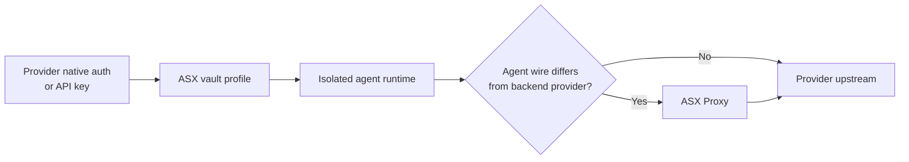
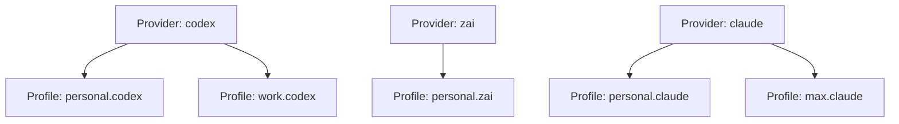
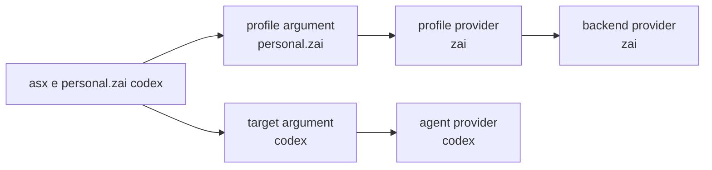
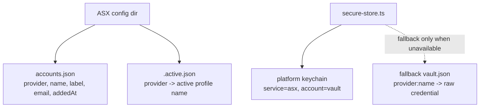
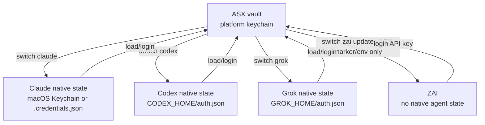
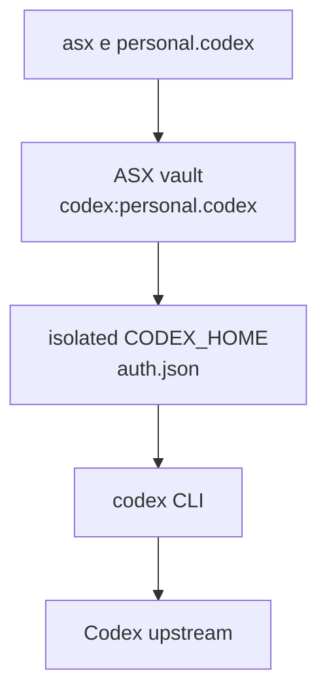
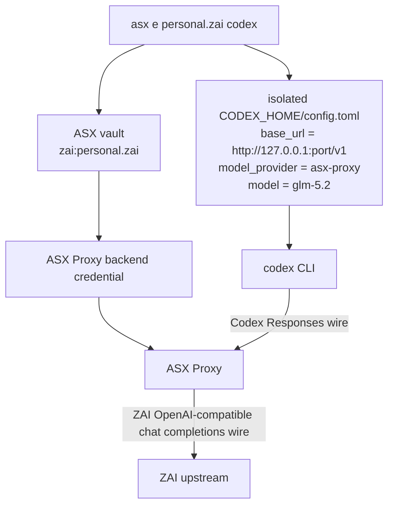
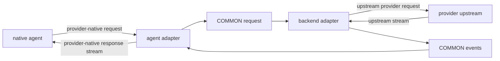
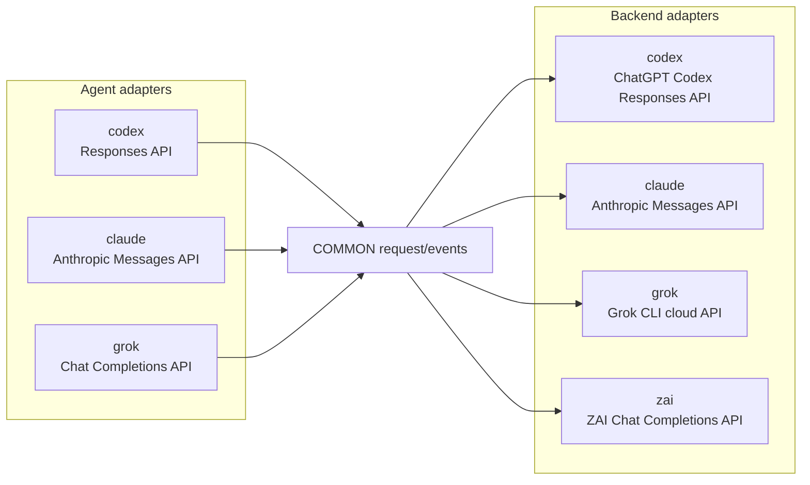

# Architecture

ASX is a small CLI that separates credential ownership from agent execution.

The core path is:



## Core Terms

```text
Provider
  A credential/backend family such as claude, codex, grok, or zai.

Profile
  One named ASX account under a provider.
  Stored as: provider + name + credential + metadata.

Agent
  The native CLI process ASX launches, such as codex, claude, or grok.

Backend
  The upstream provider that receives the final model request.
```

Provider and profile are related like this:



The profile chooses the credential. The optional target argument chooses the launched agent.



## Main Layers

### CLI

`src/cli.ts` owns command parsing and user-facing flows.

Main commands:

- `load`: snapshot the current native provider credential into ASX.
- `login`: run a provider login flow and store the result.
- `switch`: write a stored credential back to the provider's native location.
- `exec` / `e`: run an agent with an isolated profile.
- `proxy`: expose a standalone ASX Proxy endpoint.

The CLI does orchestration only. Provider-specific credential rules live in provider adapters.

### Storage

ASX keeps secrets and metadata separate.

- `src/storage/secure-store.ts` stores credentials by `${provider}:${name}`.
- `src/storage/account-store.ts` stores account metadata, labels, email, and active markers.



The credential vault is the platform keychain by default:

```text
service=asx
account=vault
```

A `0600` file vault is only used when keychain storage is unavailable:

```text
<platform config dir>/asx/vault.json
```

### Vault vs Provider-Native State

The ASX vault stores profile credentials. Provider-native state is what the original tool reads when it runs normally.



`exec` usually avoids mutating provider-native state by copying the profile credential into an isolated runtime directory.

### Provider Adapters

Provider adapters implement `ProviderAdapter` from `src/providers/base.ts`.

Common responsibilities:

- `loadCurrent(name)`: read the live provider credential and store it in ASX.
- `switchTo(name)`: make a stored profile active for normal native provider use.
- `getCurrentCredential()`: read the live provider credential for `list` matching.
- `getUsage(name)`: return displayable quota or usage text.
- `refresh(name)`: rotate expiring stored credentials when the provider supports it.
- `login(name)`: handle providers with no native CLI login, such as ZAI API keys.
- `getLoginCommand()`: return a native login command for providers with native auth.

Current provider mapping:

- `claude`: `src/providers/claude-code.ts`
- `codex`: `src/providers/codex.ts`
- `grok`: `src/providers/key-adapter.ts`
- `zai`: `src/providers/key-adapter.ts`
- `cursor`: `src/providers/cursor.ts`

## Credential Flows

### Claude

Claude native login is isolated by setting `CLAUDE_CONFIG_DIR` to a profile-scoped runtime directory before running `claude auth login`.

Normal Claude profiles store access/refresh credentials. Claude long-lived profiles store a wrapper containing `CLAUDE_CODE_OAUTH_TOKEN`; `exec` injects that value into the spawned process.

Native Claude credentials use a stable profile-scoped runtime directory so concurrent Claude sessions for the same ASX profile share Claude's own credential file.

### Codex

Codex reads and writes `auth.json` under `CODEX_HOME`.

ASX snapshots `CODEX_HOME/auth.json`, stores it in the vault, and writes it into an isolated `CODEX_HOME` during `exec` when isolation or proxy routing is needed.

### Grok

Grok native login runs `grok login`.

ASX snapshots the full `auth.json` under `GROK_HOME` or `~/.grok`, preserving the issuer wrapper. `switch` writes the stored Grok auth back to `auth.json`.

For usage and proxy calls, ASX extracts the bearer token from either the full Grok auth wrapper or a bare token.

### ZAI

ZAI has no native agent login in ASX. `asx login zai` asks for an API key, verifies it with:

```text
GET https://api.z.ai/api/coding/paas/v4/models
```

Then it stores the key in the ASX vault.

`asx load zai` can also read `ZAI_API_KEY` or `ZAI_KEY` from the environment.

`asx list zai -u` reads 5-hour quota from:

```text
GET https://api.z.ai/api/monitor/usage/quota/limit
```

ZAI `switch` cannot write to a native agent config because ASX does not manage a ZAI native agent. It updates ASX's active marker and exposes `ZAI_API_KEY` inside the current process.

## Isolated Execution

`asx exec <profile> [target?]` chooses two providers:

- profile provider: where the stored credential comes from.
- agent provider: which native binary is launched.

If no target is passed, both are the profile provider.

If a target is passed, ASX launches the target agent and uses the profile provider as the backend through ASX Proxy.

Examples:

```text
asx e personal.codex
  profile=codex, agent=codex, backend=codex

asx e personal.zai codex
  profile=zai, agent=codex, backend=zai
```

Agent runtime isolation is controlled through provider home env vars:

- Codex: `CODEX_HOME`
- Claude: `CLAUDE_CONFIG_DIR`
- Grok: `GROK_HOME`

### Same-Provider Execution

When profile provider and agent provider are the same, ASX runs the native tool with that profile's credential.



No ASX Proxy is needed because the launched agent already speaks the backend provider's native wire format.

### Cross-Provider Execution

When profile provider and agent provider differ, ASX starts a local proxy.



In this mode:

- The profile provider supplies the credential.
- The target agent supplies the local UX and request wire format.
- The proxy converts between the agent wire and backend wire.
- The native agent never receives the real backend credential directly.

## ASX Proxy

ASX Proxy is a local in-process HTTP proxy used when the launched agent wire differs from the stored backend credential.

The proxy shape is:



Files:

- `src/proxy/server.ts`: local HTTP server and request routing.
- `src/proxy/types.ts`: COMMON request, response, and adapter contracts.
- `src/proxy/inject.ts`: writes temp config/env so native agents point at ASX Proxy.
- `src/proxy/models.ts`: backend model choices shown to the launched agent.
- `src/proxy/adapters/*`: agent/backend wire adapters.

`GET /models` and `GET /v1/models` return the backend model choices. This lets Codex and Grok display backend-specific model choices during cross-provider runs.

### Proxy Adapter Composition



`zai` is backend-only because ASX does not launch a native ZAI agent.

## Adding a Provider

For credential management:

1. Add a `ProviderAdapter` implementation in `src/providers`.
2. Register it in `src/providers/index.ts`.
3. Add focused tests for load, login, switch, usage, or refresh behavior.

For proxy backend support:

1. Add a backend adapter in `src/proxy/adapters`.
2. Register it in `src/proxy/adapters/index.ts`.
3. Add default model choices in `src/proxy/models.ts`.
4. Add adapter tests and, if needed, injection/server tests.

For a new native agent frontend:

1. Add an agent adapter in `src/proxy/adapters`.
2. Register it in `src/proxy/adapters/index.ts`.
3. Add an `AGENT_SPEC` entry in `src/cli.ts`.
4. Add injection support in `src/proxy/inject.ts`.

Keep provider behavior local to the provider or proxy adapter. Avoid adding provider-specific branches to shared CLI flow unless the provider really has a different lifecycle.
