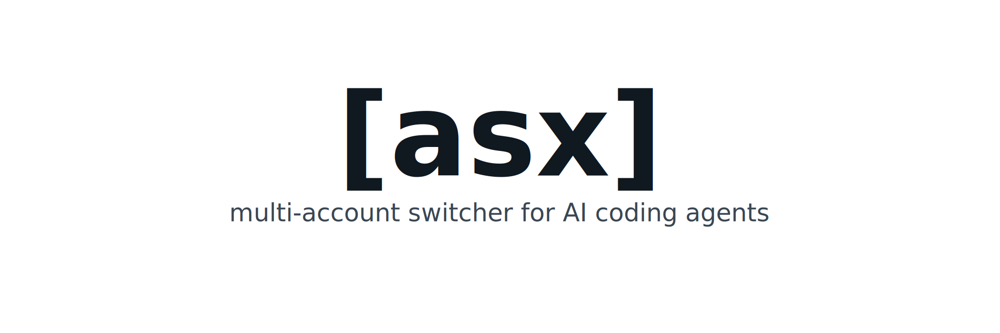

# asx

<p align="center">
  
</p>

**Multi-account switcher for LLM coding tools.**

Store each profile's credential in its own `0600` home directory and switch between accounts instantly.

## ✨ Features

- **Multiple accounts, one workflow**: Keep work, personal, and team accounts for Claude Code, Codex, Grok, Z.AI, and other providers.
- **Fast account switching**: Make a saved profile active with `asx switch` and keep `asx list` honest about what is currently loaded.
- **One-off profile runs**: Run an agent with a selected profile without changing other terminals or your default login.
- **Cross-provider execution**: Use one agent UI with another provider backend, such as running Codex while routing requests to Claude, Grok, or Z.AI. Tool calling, session continuity, and Codex multi-agent subagents (`spawn_agent`/collab) work across providers.
- **Per-profile sharing control**: Choose per profile which state (sessions, skills, agents, hooks, settings, plus opt-in Codex state/cache/logs) is shared with the provider's system home and which stays isolated.
- **Usage at a glance**: Show live quota, credits, and rate-limit information with `asx list -u`.
- **Safer login management**: Save existing sessions before new logins, load current sessions into profiles, and keep each profile's credential in its own `0600` file.
- **Cross-platform installer**: Install from GitHub Releases on macOS, Linux, and Windows.

## 📦 Installation

macOS / Linux:

```bash
curl -fsSL https://raw.githubusercontent.com/enif-lee/asx/main/install.sh | sh
```

Windows PowerShell:

```powershell
irm https://raw.githubusercontent.com/enif-lee/asx/main/install.ps1 | iex
```

The installer downloads the latest GitHub Release package. If Node.js with `npm` or `pnpm` is not available, it installs Node.js LTS first.

Development install:

```bash
npm install
npm run build
npm install -g .
```

## 🚀 Quick Start

```bash
# List accounts
asx list

# Load current active sessions
asx load
asx load claude work
asx load codex personal

# Better multi-account flow (saves existing sessions before login)
asx login codex work
asx login claude work
asx login claude personal --long-lived
asx login grok work
asx login zai work

# Switch
asx switch claude personal
# or the short alias
asx s codex work

# See what's active + usage + live system state
asx list
asx list -u

# Run under a profile-scoped home (other terminals unaffected)
asx e ed.codex "refactor this function"

# Run with automatic full-access bypass for the provider
asx e ed.codex -b "do dangerous things"

# Launch the provider desktop app under the profile when supported
asx e ed.codex --desktop .

# Cross-provider via ASX Proxy (profile provider != target agent)
# Pattern: asx e <profile = backend credential> <target = agent UI to launch>
asx e ed.claude codex "run Codex UI on the Claude backend"
asx e ed.codex claude "run Claude Code on the Codex backend"
asx e ed.claude xai "run Grok UI on the Claude backend (xai = grok alias)"
asx e personal.zai codex "run Codex UI on the ZAI backend"

# Control what the cross-provider run shares with the agent's system home
asx e personal.zai codex -i "fully isolated run"
asx e personal.zai codex --share sessions,skills "share only these"
asx e personal.zai codex --share sessions,skills,state,cache,logs "also share Codex runtime state"
```

## 📋 Commands

| Command                  | Description |
|--------------------------|-------------|
| `asx list [provider] [-u/-d]` | List accounts and each profile's shared/isolated categories. `-u/--usage` shows live quota bars. `-d/--debug` dumps stored credentials. Marks the live system credential with `(current in system)`. |
| `asx load [provider] [name]` | Register the currently active credential as a **system profile**. Auto-generates name like `ed.claude` / `ed.codex` if omitted. |
| `asx login [provider] [name] [--long-lived] [share flags]` | Login and store a new isolated profile. Provider is optional when the profile name identifies it (`asx login jn.claude`). If the target profile is current in system, login keeps the provider's normal home path. |
| `asx sharing <name> [share flags]` | Show or change what an isolated agent profile shares from its provider's system home. With no flags, prints the current setting. Only isolated agent profiles (claude/codex/grok) accept it — system and backend-only profiles are rejected. |
| `asx rename <from> <to>` | Rename an account (moves the profile home + updates metadata + active markers). |
| `asx switch <name>` / `asx switch <provider> <name>` (alias: `s`) | Switch the active credential. Provider is optional when the profile name identifies it (`asx switch ed.codex`). |
| `asx status [provider]` | Show asx-tracked active account(s). |
| `asx exec <name> [target?] [args...]` (alias: `e`) | Run the native CLI under a profile. `--desktop` launches the target provider's desktop app when supported. When `target` differs from profile provider, requests are routed via local ASX Proxy (input→common→external schema transformers). `-b/--bypass` auto-injects full access flags for CLI runs; `-d/--debug` shows proxy/exec logs. |
| `asx refresh <name>` / `asx refresh <provider> <name>` [`--no-login`] | Refresh (rotate) a stored credential using its refresh token. If the refresh token is revoked/expired, falls back to the interactive re-login flow (`--no-login` disables the fallback). `exec` also auto-refreshes expired credentials before launch. |
| `asx proxy <name> <frontend>` | Start a standalone ASX Proxy for the profile's backend and print the env/config needed to point a `<frontend>`-wire agent (`claude`, `codex`, or `grok`) at it manually. Runs until Ctrl+C. |
| `asx remove [provider] <name>` (alias: `rm`) | Remove a stored account. |

### Sharing flags (per profile)

Control what an isolated agent profile shares from the provider's system home (`~/.claude`, `~/.codex`, `~/.grok`). System profiles and backend-only profiles such as ZAI do not accept sharing flags. Default is the provider's **safe shared set**; only the credential is per-profile. Claude supports `sessions`, `skills`, `agents`, `hooks`, `settings`; Codex supports `sessions`, `skills`, `settings`, `state`, `cache`, `logs`; Grok supports `sessions`, `skills`, `settings`. Codex `state`, `cache`, and `logs` are supported but are not included in the default because they contain runtime database/cache/log files. Accepted by `asx login`, `asx load`, and `asx sharing`:

| Flag | Effect |
|------|--------|
| `--shared` | Share the provider's safe default categories. |
| `--isolated` | Fully isolate — share nothing; the profile gets its own history/settings. |
| `--share <a,b,...>` | Share only these categories; isolate the rest. |
| `--isolate <a,b,...>` | Share the provider's safe default categories except these categories. |

What each category covers (symlinked from the system home; auth files are never shared):

| Category | Claude (`~/.claude`) | Codex (`~/.codex`) | Grok (`~/.grok`) |
|----------|----------------------|--------------------|------------------|
| `sessions` | `projects/`, `sessions/`, `shell-snapshots/`, `file-history/`, `plans/`, `tasks/`, `todos/`, `history.jsonl` | `sessions/`, `archived_sessions/`, `history.jsonl`, `session_index.jsonl` | `sessions/`, `projects/`, `active_sessions.json` |
| `skills` | `skills/` | `skills/` | `skills/` |
| `agents` | `agents/` | — | — |
| `hooks` | `hooks/` | — | — |
| `settings` | `plugins/`, `settings.json`, `CLAUDE.md` | `rules/`, `plugins/`, `AGENTS.md`, `config.toml` | `completions/`, `config.toml` |
| `state` | — | `.codex-global-state.json`, `.codex-global-state.json.bak`, `.app-server-state-reconciled-v1`, `.personality_migration`, `sqlite/`, `state_*.sqlite*`, `goals_*.sqlite*`, `memories_*.sqlite*` | — |
| `cache` | — | `cache/`, `vendor_imports/`, `models_cache*.json` | — |
| `logs` | — | `log/`, `logs_*.sqlite*` | — |

The same flags work per-run on cross-provider `exec` (plus `--keep-context` to keep the per-run home for inspection). On cross-provider runs `config.toml` is never symlinked — the proxy injects its own — and existing real files in a profile home are never clobbered by a symlink.

### Desktop app launch

`asx e <profile> --desktop [path]` launches the provider desktop app with the selected profile environment. ASX tries launchers in this order:

1. Installed app bundles in `/Applications` or `~/Applications`.
2. Homebrew cask app bundles.
3. Provider CLI desktop launcher, such as `codex app`.

Same-provider desktop launches run in the background, so the `asx` command returns after opening the app. Cross-provider desktop launches stay attached because ASX Proxy and the per-run context home must stay alive for the desktop session.

Codex isolated profiles pass a profile-scoped Electron user-data directory as an app argument:

```text
<CODEX_HOME>/desktop-user-data
```

Claude isolated profiles set Claude Desktop's user-data environment variable:

```text
CLAUDE_USER_DATA_DIR=<CLAUDE_CONFIG_DIR>/desktop-user-data
```

These per-profile desktop user-data directories let a system profile and an isolated profile run at the same time. They are desktop-app browser state, not the same thing as the CLI credential home. Claude Desktop may still require signing in inside that desktop profile. The Codex CLI fallback (`codex app`) does not expose the Codex user-data option, so concurrent Codex profile windows are only guaranteed through app-bundle launchers.

Claude Desktop does not consume the Claude Code profile credential from `CLAUDE_CONFIG_DIR` as its app login. ASX therefore does not copy or inject Claude Code OAuth credentials into Claude Desktop. The supported workaround is to keep a profile-scoped `CLAUDE_USER_DATA_DIR`; sign in once inside that desktop profile, then reuse that desktop session on later launches.

Do not point multiple active Claude Desktop profiles at the same user-data directory unless you intentionally want to share the full Desktop browser session, including cookies and IndexedDB. That shares Claude Desktop state, not ASX credentials, and concurrent app instances can contend on the same Electron storage.

## 🛠 Supported Providers

| Provider     | Identifier     | Auth                                           | Usage                     |
|--------------|----------------|------------------------------------------------|---------------------------|
| Claude Code  | `claude`       | Native access/refresh tokens in profile `CLAUDE_CONFIG_DIR`; optional long-lived `CLAUDE_CODE_OAUTH_TOKEN` | 5h / 7d bars (accurate)   |
| Codex        | `codex`        | `~/.codex/auth.json` (respects `$CODEX_HOME`)     | 5h / 7d windows           |
| Grok / xAI   | `grok` (alias: `xai`) | Native `grok login`; `~/.grok/auth.json` (respects `$GROK_HOME`) | Credits + rate limits     |
| Z.AI         | `zai`          | API key via `asx login zai`; `ZAI_API_KEY`/`ZAI_KEY` for `asx load` | 5h quota via monitor API  |
| Cursor       | `cursor`       | Metadata only (limited)                           | Metadata only             |

More providers can be added easily via the adapter pattern.

## 🔐 How It Works

### System Profiles vs Isolated Profiles

- A **system profile** is registered with `asx load`. It represents the provider's normal user-level home (`~/.claude`, `~/.codex`, `~/.grok`) and does not use sharing/isolation settings.
- An **isolated profile** is created with `asx login`. It owns a persistent home directory under the asx config dir (e.g. `~/Library/Application Support/asx/profiles/<provider>-<name>/`, `0700`). File-based providers store the credential there using the provider's native filename (`auth.json`, `.credentials.json`, ...). Claude on macOS stores OAuth credentials in the profile-specific Keychain service derived from that home path.
- Provider *native* state (your default login, used when you run the tool directly) is separate from asx profile homes:
  - Claude native credential: Claude Keychain item on macOS, `.credentials.json` on Linux/Windows.
  - Codex native credential: `~/.codex/auth.json`.
  - Grok native credential: `~/.grok/auth.json`.
  - ZAI: no native agent state; asx stores the API key in the profile home.
- `asx load` reads the currently active provider-native credential and registers it as a system profile.
- `asx switch` writes a stored profile back to provider-native state when the provider has one. ZAI only updates asx's active marker and process env for the current command.

### Login And Execution

- `asx login claude [name]` runs `claude auth login` with `CLAUDE_CONFIG_DIR` pointed at the isolated profile home. On macOS, ASX reads/writes the matching `Claude Code-credentials-<sha256(CLAUDE_CONFIG_DIR)[:8]>` Keychain entry; on Linux/Windows, it uses `.credentials.json`. If `[name]` is current in system, it keeps the normal Claude home path and updates that credential instead.
- `asx login claude [name] --long-lived` runs `claude setup-token`, asks for the long-lived token, and stores it in the profile home for `CLAUDE_CODE_OAUTH_TOKEN` execution.
- `asx login codex [name]` and `asx login grok [name]` run the native login flow inside the isolated profile home unless `[name]` is current in system.
- `asx login zai [name]` asks for an API key, validates it with `GET https://api.z.ai/api/coding/paas/v4/models`, then stores it in the profile home.
- Claude long-lived token profiles only update asx's active marker on `switch`; `exec` injects `CLAUDE_CODE_OAUTH_TOKEN`.
- `exec` / `e` keeps system profiles on the provider's normal home path. For isolated profiles it injects the provider's home env var (`CLAUDE_CONFIG_DIR` / `CODEX_HOME` / `GROK_HOME`) to point at the isolated profile home.
  - Session history and shared setup (`projects`/`sessions`/`history`, plus provider-supported `skills`/`agents`/`hooks`/`settings`, and opt-in Codex `state`/`cache`/`logs`) are **symlinked** from the provider's system home (`~/.claude`, `~/.codex`, `~/.grok`) into isolated agent profiles. Backend-only profiles do not participate.
  - Cross-provider runs launch the agent binary under a fresh per-run context home, route real requests through the local ASX Proxy using the profile's backend credential, then delete that context when the agent exits. Cross context options are consumed before agent args: `-s`/`--shared`, `-i`/`--isolated`, `--share <categories>`, `--isolate <categories>`, `--keep-context`. Use `--` to force later args through to the agent.
  - `-b / --bypass` automatically injects the appropriate full-access flags for the provider.
- `list` (and `list -u`) detects the *live* credential currently loaded in the system (native keychain/auth files) and annotates the matching stored account with `(current in system)`.

## 🖥️ Development

```bash
npm run dev          # run with tsx
npm run build        # tsc + chmod
npm test
```

Developer guide: [Adding an Agent or Provider](docs/ADDING_AGENT_OR_PROVIDER.md)

Release:

```bash
gh workflow run "Publish Release" -f version=0.1.0
```

## 📄 License

MIT

---

Made with ❤️ for people who live in multiple LLM accounts. 
