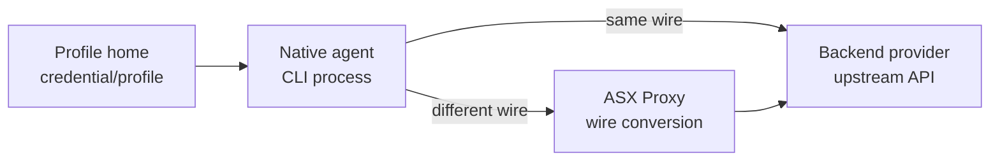

# Adding an Agent or Provider

This guide lists the implementation points for adding a new provider, a new native agent, or both.

ASX has three separate concerns:



## First Decision

Decide which shape you are adding:

| Shape | Example | Required work |
|---|---|---|
| Credential provider only | API-key service with no CLI | provider adapter |
| Backend only | ZAI routed through Codex/Grok | backend adapter + models |
| Native agent only | New CLI using existing backend | agent spec + inject + agent adapter |
| Full provider + agent | Claude, Codex, Grok style | provider adapter + agent adapter + backend adapter |

Keep provider-specific behavior inside the provider or proxy adapter. Add branches in `src/cli.ts` only when the lifecycle really differs.

## Provider Adapter

Provider adapters live under `src/providers` and implement `ProviderAdapter` from `src/providers/base.ts`.

Checklist:

- Add or reuse a provider adapter module.
- Register it in `src/providers/index.ts`.
- Add provider aliases or target names to `normalizeProvider()` / `KNOWN_TARGET_PROVIDERS` only when users should type those names.
- Add focused tests for `loadCurrent`, `login`, `switchTo`, `getUsage`, and `refresh` only when implemented.

Adapter responsibilities:

| Method | When to implement |
|---|---|
| `loadCurrent(name)` | The provider has a native credential or env key ASX can snapshot. |
| `login(name)` | ASX must collect an API key or run a custom login flow. |
| `getLoginCommand()` | The provider already has a native CLI login command. |
| `switchTo(name)` | Normal CLI usage should be changed to this stored profile. |
| `getCurrentCredential()` | `asx list` should mark `(current in system)`. |
| `getUsage(name)` | A stable usage or quota endpoint exists. |
| `isExpired()` / `refresh()` | Stored credentials expire and can be refreshed safely. |
| `clearCurrent()` | `asx login` needs to temporarily remove local native state before native login. |

## Profile Home Rules

Use `src/storage/secure-store.ts` for credentials:

```ts
await setSecret(provider, name, rawCredential);
const rawCredential = await getSecret(provider, name);
```

Rules:

- Each profile's home directory is the source of truth for its stored credential.
- `setSecret`/`getSecret` read/write a `0600` file inside the profile home (`<asx config>/profiles/<provider>-<name>/`), named to match the provider's native auth file so the same directory can be handed to the native CLI via its home env var.
- Account metadata belongs in `src/storage/account-store.ts`, not with the credential.
- Storage is plain `0600` files under the asx config dir — there is no OS keychain.
- Do not store secrets in README, config samples, tests, or logs.
- Preserve the provider's native credential shape when snapshotting. If the native file is a JSON wrapper, store the wrapper unless there is a clear reason to extract one field.

`switchTo()` may mutate provider-native state. `exec` should prefer the profile or scratch home so other terminals are not affected.

## Native Agent Configuration

If ASX launches a new native CLI, add an agent spec in `src/cli.ts`:

```ts
const AGENT_SPEC: Record<string, AgentSpec> = {
  provider: {
    bin: 'provider-cli',
    homeEnv: 'PROVIDER_HOME',
    sub: 'provider',
    file: 'auth.json',
    bypass: [],
    stub: null,
  },
};
```

Checklist:

- Use the native CLI's real config/home environment variable.
- Seed only the files required to make the agent start.
- Keep generated runtime files inside the profile home or ASX scratch home under the profiles directory.
- Add bypass flags only if the native CLI already supports them.
- Add config injection in `src/proxy/inject.ts` when this agent can be routed through ASX Proxy.
- Add an injection test in `src/proxy/inject.test.ts`.

Prefer profile or scratch homes over editing the user's global native config. Use the provider's real home env var when the provider's own refresh/session flow expects a consistent config path.

## Proxy Adapter

ASX Proxy uses a hub-and-spoke shape:


Do not add provider-to-provider converters. Each adapter only converts between its own wire format and `COMMON` from `src/proxy/types.ts`.

### Backend Provider

Add a backend adapter when a stored profile can call an upstream API.

Checklist:

- Add `src/proxy/adapters/<provider>.ts`.
- Implement `BackendAdapter.buildRequest()`.
- Implement `BackendAdapter.parseStreamChunk()`.
- Register it in `src/proxy/adapters/index.ts`.
- Add default choices in `src/proxy/models.ts`.
- Add adapter tests in `src/proxy/adapters/adapters.test.ts`.

`buildRequest()` receives the raw stored credential. The native agent must not receive backend credentials directly during cross-provider execution.

### Native Agent Frontend

Add an agent adapter when a CLI sends requests to ASX Proxy.

Checklist:

- Implement `AgentAdapter.parseRequest()`.
- Implement streaming headers and chunk formatting.
- Implement non-stream response formatting.
- Register the agent adapter in `src/proxy/adapters/index.ts`.
- Add config injection in `src/proxy/inject.ts`.
- Add server or adapter tests for the wire format.

Keep unsupported features explicit. If tools, images, cache control, or provider-specific metadata are not translated, pass through only when safe or return a clear error.

## Models

Backend model choices live in `src/proxy/models.ts`.

Checklist:

- Add a default model list for the backend provider.
- Use `id` for what the agent sees.
- Use `model` for the upstream model id.
- Use `effort` only when the backend supports reasoning effort.
- Keep `ASX_<PROVIDER>_MODELS` override working.

The first model is the default used by injected agent config.

## Usage Tracking

Add `getUsage()` only when there is a stable provider endpoint.

Rules:

- Prefer quota endpoints over local logs.
- Return a short terminal-friendly string.
- Use `renderBar(remainingPct)` for quota bars.
- Do not label usage statistics as limits.
- On auth failure, return a clear re-login or failed-fetch message.

## Tests

Minimum tests by change type:

| Change | Test file |
|---|---|
| Provider credential flow | `src/providers/*.test.ts` |
| Profile-home storage behavior | `src/storage/secure-store.test.ts` |
| Proxy adapter | `src/proxy/adapters/adapters.test.ts` |
| Proxy routing/models | `src/proxy/server.test.ts` |
| Config injection | `src/proxy/inject.test.ts` |
| CLI flow | CLI-level test or focused provider/proxy tests |

Run:

```bash
npm test
npm run build
```

## Release Checklist

- Provider is registered.
- Native agent target is normalized if users can type it.
- Profile credentials are stored through `secure-store.ts`.
- Native config writes are isolated unless the command is `switch`.
- Proxy adapter is registered for each supported role: agent, backend, or both.
- Model choices appear through `/models` and `/v1/models`.
- Usage output is accurate and not overstated.
- README supported-provider table is updated.
- `ARCHITECTURE.md` is updated when the provider adds a new credential or proxy pattern.
